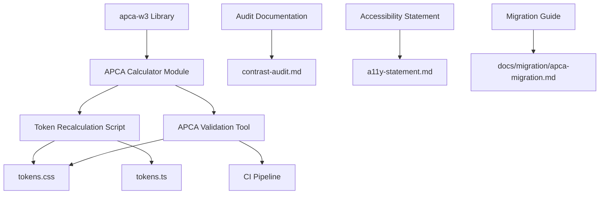

# Design Document: APCA Migration

## Overview

This design document specifies the technical approach for migrating the paul design system from WCAG 2.x relative luminance contrast ratios to APCA (Accessible Perceptual Contrast Algorithm) compliance. The migration involves integrating the `apca-w3` npm package, recalculating all color tokens to meet APCA Lc thresholds, updating documentation to reflect WCAG 3.0 (draft) standards, and implementing automated validation tooling.

### Background

WCAG 2.x uses a relative luminance formula that produces contrast ratios from 1:1 to 21:1. While mathematically sound, this approach has known perceptual limitations — it does not account for how human vision perceives contrast across different luminance levels and spatial frequencies.

APCA addresses these limitations by providing perceptually uniform contrast measurements using Lc (Lightness contrast) values ranging from 0 to ±108.3. The polarity (positive for light-on-dark, negative for dark-on-light) preserves directional information that affects readability. APCA is proposed for WCAG 3.0 and represents a significant improvement in accessibility science.

### Goals

1. **Perceptual Uniformity**: Achieve consistent perceived contrast across all color tokens
2. **WCAG 3.0 Alignment**: Position the design system for future standards compliance
3. **Backward Compatibility**: Maintain approximate WCAG 2.2 equivalence where applicable
4. **Automation**: Integrate validation tooling into CI/CD pipeline
5. **Transparency**: Document the migration rationale and WCAG 3.0 draft status

### Non-Goals

- Redesigning visual aesthetics beyond what is required for APCA compliance
- Supporting WCAG 2.x and APCA simultaneously (APCA replaces WCAG 2.x)
- Implementing APCA for non-color accessibility concerns (focus indicators, target sizes, etc.)

---

## Architecture

### System Components



### Data Flow

1. **Calculation Phase**:
   - Input: Current HSL color tokens from `tokens.css`
   - Process: Convert HSL → RGB → APCA Lc calculation via `apca-w3`
   - Output: Lc values for each foreground-background pair

2. **Recalculation Phase**:
   - Input: Lc values below threshold
   - Process: Adjust lightness while preserving hue and saturation
   - Output: Updated HSL values meeting APCA thresholds

3. **Validation Phase**:
   - Input: Updated `tokens.css`
   - Process: Automated APCA validation tool
   - Output: Pass/fail status and JSON report

4. **Documentation Phase**:
   - Input: Before/after Lc values
   - Process: Generate comparison tables and migration notes
   - Output: Updated audit documentation and migration guide

---

## Components and Interfaces

### 1. APCA Calculator Module

**Location**: `packages/tokens/scripts/apca-calculator.ts`

**Purpose**: Wrapper around `apca-w3` library providing type-safe APCA calculations

**Interface**:

```typescript
interface APCACalculator {
  /**
   * Calculate APCA Lc value for a foreground-background color pair
   * @param foreground - RGB color object { r, g, b } (0-255)
   * @param background - RGB color object { r, g, b } (0-255)
   * @returns Lc value (-108.3 to 108.3)
   */
  calculateLc(foreground: RGB, background: RGB): number;

  /**
   * Convert HSL to RGB
   * @param hsl - HSL color object { h, s, l } (h: 0-360, s/l: 0-100)
   * @returns RGB color object { r, g, b } (0-255)
   */
  hslToRgb(hsl: HSL): RGB;

  /**
   * Convert RGB to HSL
   * @param rgb - RGB color object { r, g, b } (0-255)
   * @returns HSL color object { h, s, l } (h: 0-360, s/l: 0-100)
   */
  rgbToHsl(rgb: RGB): HSL;

  /**
   * Check if Lc value meets threshold for given use case
   * @param lc - APCA Lc value
   * @param useCase - 'body-text' | 'large-text' | 'ui-component'
   * @returns boolean indicating compliance
   */
  meetsThreshold(lc: number, useCase: UseCase): boolean;
}

type RGB = { r: number; g: number; b: number };
type HSL = { h: number; s: number; l: number };
type UseCase = 'body-text' | 'large-text' | 'ui-component';
```

**Dependencies**: `apca-w3`

**Implementation Notes**:
- The `apca-w3` library accepts RGB values and returns Lc values with polarity
- Absolute value of Lc is used for threshold comparison (polarity is preserved for documentation)
- Thresholds: Lc 75 for body text, Lc 60 for large text and UI components

---

### 2. Token Recalculation Script

**Location**: `packages/tokens/scripts/recalculate-tokens.ts`

**Purpose**: Automated script to recalculate color tokens to meet APCA thresholds

**Interface**:

```typescript
interface TokenRecalculator {
  /**
   * Recalculate all tokens in tokens.css to meet APCA thresholds
   * @param inputPath - Path to tokens.css
   * @param outputPath - Path to write updated tokens.css
   * @param dryRun - If true, only report changes without writing
   * @returns RecalculationReport
   */
  recalculateTokens(
    inputPath: string,
    outputPath: string,
    dryRun?: boolean
  ): RecalculationReport;

  /**
   * Adjust lightness of a color to meet target Lc
   * @param color - HSL color object
   * @param background - HSL background color
   * @param targetLc - Target APCA Lc value
   * @returns Adjusted HSL color
   */
  adjustLightness(
    color: HSL,
    background: HSL,
    targetLc: number
  ): HSL;
}

interface RecalculationReport {
  totalTokens: number;
  tokensChanged: number;
  changes: TokenChange[];
}

interface TokenChange {
  tokenName: string;
  mode: 'light' | 'dark';
  before: HSL;
  after: HSL;
  lcBefore: number;
  lcAfter: number;
  background: string;
}
```

**Algorithm**:

1. Parse `tokens.css` to extract all color tokens
2. For each foreground token:
   - Identify all backgrounds it appears on (from usage analysis)
   - Calculate current Lc value for each foreground-background pair
   - If Lc < threshold:
     - Binary search lightness adjustment to reach target Lc
     - Preserve hue and saturation
     - Verify adjusted color meets threshold on all backgrounds
3. Generate inline comments documenting Lc values
4. Write updated tokens to output file

**Constraints**:
- Lightness adjustments must not exceed ±15% to preserve visual identity
- If threshold cannot be met within lightness constraint, flag for manual review
- Hue and saturation must remain unchanged

---

### 3. APCA Validation Tool

**Location**: `packages/tokens/scripts/validate-apca.ts`

**Purpose**: Automated validation tool to verify APCA compliance of color tokens

**Interface**:

```typescript
interface APCAValidator {
  /**
   * Validate all tokens in tokens.css against APCA thresholds
   * @param tokensPath - Path to tokens.css
   * @returns ValidationResult
   */
  validate(tokensPath: string): ValidationResult;

  /**
   * Output validation results in JSON format
   * @param result - ValidationResult object
   * @param outputPath - Path to write JSON report
   */
  outputJSON(result: ValidationResult, outputPath: string): void;
}

interface ValidationResult {
  passed: boolean;
  totalChecks: number;
  failedChecks: number;
  failures: ValidationFailure[];
}

interface ValidationFailure {
  tokenName: string;
  mode: 'light' | 'dark';
  foreground: HSL;
  background: string;
  backgroundHSL: HSL;
  lcValue: number;
  threshold: number;
  useCase: UseCase;
}
```

**Usage**:

```bash
# Run validation
pnpm run validate:apca

# Output JSON report
pnpm run validate:apca --json=./apca-report.json

# Exit codes:
# 0 - All checks passed
# 1 - One or more checks failed
```

**CI Integration**:

Add to `.github/workflows/ci.yml`:

```yaml
- name: Validate APCA Compliance
  run: pnpm run validate:apca
```

---

### 4. APCA Parser and Printer

**Location**: `packages/tokens/scripts/apca-parser.ts`

**Purpose**: Parse and format APCA Lc values for documentation and validation

**Interface**:

```typescript
interface APCAParser {
  /**
   * Parse Lc string into numeric value
   * @param lcString - String in format "Lc 75.3" or "Lc -60.2"
   * @returns Numeric Lc value
   * @throws Error if string is invalid
   */
  parse(lcString: string): number;

  /**
   * Format numeric Lc value into standard string format
   * @param lcValue - Numeric Lc value
   * @returns String in format "Lc XX.X"
   */
  print(lcValue: number): string;
}
```

**Implementation**:

```typescript
export const APCAParser = {
  parse(lcString: string): number {
    const match = lcString.match(/^Lc\s+([-+]?\d+(?:\.\d+)?)$/);
    if (!match) {
      throw new Error(`Invalid Lc string: "${lcString}". Expected format: "Lc XX.X"`);
    }
    const value = parseFloat(match[1]);
    if (value < -108.3 || value > 108.3) {
      throw new Error(`Lc value out of range: ${value}. Must be between -108.3 and 108.3`);
    }
    return value;
  },

  print(lcValue: number): string {
    if (lcValue < -108.3 || lcValue > 108.3) {
      throw new Error(`Lc value out of range: ${lcValue}. Must be between -108.3 and 108.3`);
    }
    return `Lc ${lcValue.toFixed(1)}`;
  }
};
```

---

## Data Models

### Color Token Model

```typescript
interface ColorToken {
  name: string;              // e.g., "muted-foreground"
  mode: 'light' | 'dark';
  hsl: HSL;                  // HSL channel values
  cssVariable: string;       // e.g., "--muted-foreground"
  useCase: UseCase;          // 'body-text' | 'large-text' | 'ui-component'
  backgrounds: string[];     // CSS variable names of backgrounds this token appears on
}
```

### APCA Measurement Model

```typescript
interface APCAMeasurement {
  foregroundToken: string;   // CSS variable name
  backgroundToken: string;   // CSS variable name
  mode: 'light' | 'dark';
  lcValue: number;           // APCA Lc value (-108.3 to 108.3)
  polarity: 'light-on-dark' | 'dark-on-light';
  threshold: number;         // Required Lc threshold for use case
  compliant: boolean;        // Whether lcValue meets threshold
}
```

### Token Usage Map

The following map defines which foreground tokens appear on which backgrounds:

```typescript
const TOKEN_USAGE_MAP: Record<string, string[]> = {
  'foreground': ['background', 'card', 'popover'],
  'card-foreground': ['card'],
  'popover-foreground': ['popover'],
  'primary-foreground': ['primary'],
  'secondary-foreground': ['secondary'],
  'muted-foreground': ['background', 'muted', 'card'],
  'accent-foreground': ['accent'],
  'destructive-foreground': ['destructive'],
  'destructive-text': ['background', 'card'],
  'sidebar-foreground': ['sidebar'],
  'sidebar-primary-foreground': ['sidebar-primary'],
  'sidebar-accent-foreground': ['sidebar-accent'],
};
```

---

## Correctness Properties

*A property is a characteristic or behavior that should hold true across all valid executions of a system—essentially, a formal statement about what the system should do. Properties serve as the bridge between human-readable specifications and machine-verifiable correctness guarantees.*

The APCA migration feature includes pure calculation and parsing logic that is well-suited for property-based testing. The following properties define the correctness guarantees for these components.

### Property 1: APCA Lc Values Within Valid Range

*For any* valid RGB color pair (foreground and background), the calculated APCA Lc value SHALL be within the range -108.3 to 108.3 (inclusive).

**Validates: Requirements 1.3**

**Rationale**: The APCA algorithm defines Lc values as ranging from -108.3 (maximum light-on-dark contrast) to 108.3 (maximum dark-on-light contrast). Any value outside this range indicates a calculation error.

### Property 2: APCA Polarity Preservation

*For any* RGB color pair where the foreground is lighter than the background (higher relative luminance), the calculated APCA Lc value SHALL be positive. *For any* RGB color pair where the foreground is darker than the background, the calculated APCA Lc value SHALL be negative.

**Validates: Requirements 1.4**

**Rationale**: APCA uses polarity to distinguish light-on-dark (positive Lc) from dark-on-light (negative Lc). This distinction is perceptually meaningful and must be preserved.

### Property 3: Hue and Saturation Preservation During Lightness Adjustment

*For any* HSL color and target Lc value, when the lightness adjustment function is applied, the resulting HSL color SHALL have the same hue and saturation as the input color (only lightness may change).

**Validates: Requirements 2.2**

**Rationale**: The recalculation algorithm must preserve the visual identity of colors by maintaining hue and saturation. Only lightness is adjusted to meet APCA thresholds.

### Property 4: APCA Parser and Printer Round-Trip

*For any* valid numeric Lc value in the range -108.3 to 108.3, the following round-trip SHALL produce an equivalent value:

```
parse(print(lcValue)) ≈ lcValue
```

Where equivalence allows for floating-point precision differences (±0.1).

**Validates: Requirements 9.4**

**Rationale**: The parser and printer are inverse operations. If both are implemented correctly, converting a numeric value to a string and back should preserve the value (within floating-point precision limits).

### Property 5: APCA Parser Error Handling

*For any* string that does not match the format `"Lc XX.X"` (where XX.X is a number in range -108.3 to 108.3), the parser SHALL throw a descriptive error that includes the invalid input.

**Validates: Requirements 9.2**

**Rationale**: Invalid input should be rejected with clear error messages to aid debugging. The error message must include the invalid input to help developers identify the source of the problem.

---

## Error Handling

### APCA Calculation Errors

**Scenario**: Invalid RGB values provided to `apca-w3`

**Handling**:
- Validate RGB values are in range 0-255 before calling `apca-w3`
- Throw descriptive error with token name and invalid values
- Log error to console with stack trace

**Example**:

```typescript
if (rgb.r < 0 || rgb.r > 255 || rgb.g < 0 || rgb.g > 255 || rgb.b < 0 || rgb.b > 255) {
  throw new Error(
    `Invalid RGB values for token "${tokenName}": r=${rgb.r}, g=${rgb.g}, b=${rgb.b}. ` +
    `All values must be in range 0-255.`
  );
}
```

### Token Parsing Errors

**Scenario**: Malformed HSL values in `tokens.css`

**Handling**:
- Use regex to validate HSL format: `\d+(\.\d+)?\s+\d+(\.\d+)?%\s+\d+(\.\d+)?%`
- If parsing fails, throw error with line number and token name
- Provide example of correct format in error message

**Example**:

```typescript
const hslRegex = /^(\d+(?:\.\d+)?)\s+(\d+(?:\.\d+)?)%\s+(\d+(?:\.\d+)?)%$/;
const match = hslString.match(hslRegex);
if (!match) {
  throw new Error(
    `Invalid HSL format for token "${tokenName}" at line ${lineNumber}: "${hslString}". ` +
    `Expected format: "240 5% 33%"`
  );
}
```

### Threshold Compliance Errors

**Scenario**: Token cannot meet APCA threshold within lightness constraint

**Handling**:
- Log warning with token name, current Lc, target Lc, and constraint
- Flag token for manual review
- Continue processing remaining tokens
- Include flagged tokens in recalculation report

**Example**:

```typescript
if (Math.abs(adjustedHSL.l - originalHSL.l) > 15) {
  console.warn(
    `Warning: Token "${tokenName}" cannot meet Lc ${targetLc} within ±15% lightness constraint. ` +
    `Current Lc: ${currentLc}, Adjusted lightness: ${adjustedHSL.l}%. ` +
    `Manual review required.`
  );
  flaggedTokens.push(tokenName);
}
```

### Validation Errors

**Scenario**: Validation tool encounters missing token or background

**Handling**:
- Skip validation for missing token-background pair
- Log warning with missing token/background name
- Continue validation for remaining pairs
- Include warnings in validation report

**Example**:

```typescript
if (!backgroundToken) {
  console.warn(
    `Warning: Background token "${backgroundName}" not found for foreground "${foregroundName}". ` +
    `Skipping validation for this pair.`
  );
  continue;
}
```

---

## Testing Strategy

This feature involves color calculation algorithms, file parsing, and documentation updates. The testing strategy combines **property-based tests** for pure calculation logic, **unit tests** for specific examples and edge cases, **integration tests** for file I/O, and **manual verification** for visual changes.

### Property-Based Tests

**Scope**: APCA calculation logic, HSL/RGB conversion, parser/printer functions, lightness adjustment

**Framework**: [fast-check](https://fast-check.dev/) (JavaScript property-based testing library)

**Configuration**: Minimum 100 iterations per property test

**Property Tests**:

1. **Property 1: APCA Lc Values Within Valid Range**
   - **Generator**: Random RGB color pairs (r, g, b in range 0-255)
   - **Property**: `|calculateLc(fg, bg)| <= 108.3`
   - **Tag**: `Feature: apca-migration, Property 1: For any valid RGB color pair, the calculated APCA Lc value SHALL be within the range -108.3 to 108.3`

2. **Property 2: APCA Polarity Preservation**
   - **Generator**: Random RGB color pairs
   - **Property**: If `luminance(fg) > luminance(bg)` then `calculateLc(fg, bg) > 0`, else `calculateLc(fg, bg) < 0`
   - **Tag**: `Feature: apca-migration, Property 2: For any RGB color pair, polarity matches relative luminance`

3. **Property 3: Hue and Saturation Preservation**
   - **Generator**: Random HSL colors and target Lc values
   - **Property**: `adjustLightness(hsl, bg, targetLc).h === hsl.h && adjustLightness(hsl, bg, targetLc).s === hsl.s`
   - **Tag**: `Feature: apca-migration, Property 3: Lightness adjustment preserves hue and saturation`

4. **Property 4: Parser/Printer Round-Trip**
   - **Generator**: Random Lc values in range -108.3 to 108.3
   - **Property**: `Math.abs(parse(print(lc)) - lc) < 0.1`
   - **Tag**: `Feature: apca-migration, Property 4: Parser and printer are inverse operations`

5. **Property 5: Parser Error Handling**
   - **Generator**: Random invalid Lc strings (wrong format, out of range, etc.)
   - **Property**: `parse(invalidString)` throws error containing `invalidString`
   - **Tag**: `Feature: apca-migration, Property 5: Parser rejects invalid input with descriptive errors`

**Example Property Test**:

```typescript
import { describe, it } from 'vitest';
import fc from 'fast-check';
import { APCAParser } from './apca-parser';

describe('APCAParser - Property Tests', () => {
  it('Property 4: Parser/Printer round-trip preserves value', () => {
    // Feature: apca-migration, Property 4: Parser and printer are inverse operations
    fc.assert(
      fc.property(
        fc.double({ min: -108.3, max: 108.3 }),
        (lcValue) => {
          const printed = APCAParser.print(lcValue);
          const parsed = APCAParser.parse(printed);
          return Math.abs(parsed - lcValue) < 0.1;
        }
      ),
      { numRuns: 100 }
    );
  });

  it('Property 5: Parser error handling for invalid input', () => {
    // Feature: apca-migration, Property 5: Parser rejects invalid input with descriptive errors
    fc.assert(
      fc.property(
        fc.oneof(
          fc.string().filter(s => !s.match(/^Lc\s+[-+]?\d+(\.\d+)?$/)),
          fc.constant('Lc 150'),
          fc.constant('Lc -150'),
          fc.constant('75.3'),
          fc.constant('invalid')
        ),
        (invalidString) => {
          try {
            APCAParser.parse(invalidString);
            return false; // Should have thrown
          } catch (error) {
            return error.message.includes(invalidString) || 
                   error.message.includes('out of range');
          }
        }
      ),
      { numRuns: 100 }
    );
  });
});
```

### Unit Tests

**Scope**: Specific examples, edge cases, threshold checking

**Framework**: Vitest (existing test framework in the project)

**Test Cases**:

1. **APCA Calculator - Edge Cases**:
   - Identical colors produce Lc ≈ 0
   - Pure black on pure white produces maximum Lc
   - Known color pairs produce expected Lc values (test against reference values from APCA documentation)

2. **HSL/RGB Conversion - Edge Cases**:
   - Pure black (0, 0%, 0%) converts correctly
   - Pure white (0, 0%, 100%) converts correctly
   - Pure red (0, 100%, 50%) converts correctly
   - Grayscale colors (saturation = 0%) convert correctly

3. **APCA Parser - Specific Examples**:
   - "Lc 75.3" → 75.3
   - "Lc -60.2" → -60.2
   - "Lc 0" → 0

4. **APCA Printer - Specific Examples**:
   - 75.3 → "Lc 75.3"
   - -60.2 → "Lc -60.2"
   - 0 → "Lc 0.0"

5. **Threshold Checking**:
   - Lc 75 passes for body text
   - Lc 74.9 fails for body text
   - Lc 60 passes for large text
   - Lc 59.9 fails for large text

**Example Unit Test**:

```typescript
import { describe, it, expect } from 'vitest';
import { APCACalculator } from './apca-calculator';

describe('APCACalculator - Edge Cases', () => {
  it('should return Lc ≈ 0 for identical colors', () => {
    const color = { r: 128, g: 128, b: 128 };
    const lc = APCACalculator.calculateLc(color, color);
    expect(Math.abs(lc)).toBeLessThan(1);
  });

  it('should return maximum Lc for black on white', () => {
    const black = { r: 0, g: 0, b: 0 };
    const white = { r: 255, g: 255, b: 255 };
    const lc = APCACalculator.calculateLc(black, white);
    expect(Math.abs(lc)).toBeGreaterThan(100);
  });
});
```

### Integration Tests

**Scope**: Token recalculation script, validation tool, file I/O

**Test Cases**:

1. **Token Recalculation**:
   - Script reads tokens.css and produces valid output
   - Recalculated tokens meet APCA thresholds
   - Hue and saturation are preserved
   - Inline comments are added with Lc values
   - Dry-run mode does not modify files

2. **APCA Validation**:
   - Validation tool reads tokens.css and produces JSON report
   - Compliant tokens pass validation
   - Non-compliant tokens fail validation with correct error details
   - Exit code is 0 for pass, 1 for fail

3. **CI Integration**:
   - Validation tool runs in CI pipeline
   - CI fails when validation fails
   - JSON report is generated as artifact

### Visual Regression Tests

**Scope**: Chromatic visual regression baselines

**Process**:

1. Run Chromatic after token recalculation
2. Review visual diffs for all stories
3. Accept diffs as new baseline for tokens with changed lightness
4. Document expected diffs in audit documentation

**Expected Diffs**:

- Stories using `--muted-foreground`: text becomes marginally darker (light mode) or lighter (dark mode)
- Stories using `--destructive-text`: text becomes marginally darker (light mode) or lighter (dark mode)
- No layout or structural changes

### Manual Verification

**Scope**: Accessibility statement, audit documentation, migration guide

**Checklist**:

- [ ] Accessibility statement includes WCAG 3.0 (draft) status
- [ ] Accessibility statement includes disclaimer about draft status
- [ ] Audit documentation includes before/after Lc values table
- [ ] Audit documentation references `apca-w3` library
- [ ] Migration guide documents all token changes
- [ ] Migration guide includes visual comparison examples
- [ ] Migration guide includes FAQ about WCAG 3.0 draft status

---

## Migration Plan

### Phase 1: Setup and Integration (Week 1)

1. Install `apca-w3` as dev dependency
2. Implement APCA Calculator module
3. Implement APCA Parser and Printer
4. Write unit tests for calculator and parser
5. Verify `apca-w3` integration with known color pairs

### Phase 2: Token Recalculation (Week 2)

1. Implement Token Recalculation script
2. Run script in dry-run mode to generate report
3. Review flagged tokens requiring manual adjustment
4. Execute recalculation and update `tokens.css` and `tokens.ts`
5. Verify all tokens meet APCA thresholds

### Phase 3: Validation Tooling (Week 2)

1. Implement APCA Validation tool
2. Write integration tests for validation tool
3. Integrate validation tool into CI pipeline
4. Verify CI fails when validation fails

### Phase 4: Documentation (Week 3)

1. Update `contrast-audit.md` with APCA methodology
2. Add before/after Lc values table to audit documentation
3. Update `a11y-statement.md` with WCAG 3.0 (draft) status
4. Create migration guide at `docs/migration/apca-migration.md`
5. Document visual diffs and expected changes

### Phase 5: Visual Regression (Week 3)

1. Run Chromatic visual regression tests
2. Review and accept visual diffs
3. Update Chromatic baselines
4. Document expected diffs in audit documentation

### Phase 6: Release (Week 4)

1. Bump version to v1.1.0
2. Publish updated packages to npm
3. Announce migration in release notes
4. Monitor for issues and feedback

---

## Backward Compatibility

### WCAG 2.2 Equivalence

APCA Lc values approximate WCAG 2.x ratios as follows:

| APCA Lc | WCAG 2.x Ratio | Level |
|---------|----------------|-------|
| Lc 90   | ~10:1          | AAA+ (preferred) |
| Lc 75   | ~7:1           | AAA |
| Lc 60   | ~4.5:1         | AA |
| Lc 45   | ~3:1           | AA (large text) |

**Note**: This mapping is approximate. APCA and WCAG 2.x use different perceptual models and are not directly comparable. The equivalence is provided for stakeholder communication only.

### Transition Period

During the transition period (v1.1.0 to v2.0.0):

- Accessibility statement maintains both WCAG 2.2 and WCAG 3.0 conformance claims
- Audit documentation includes both WCAG 2.x ratios and APCA Lc values
- Migration guide explains the shift and provides rationale

After v2.0.0:

- WCAG 2.2 conformance claims are removed
- Only APCA Lc values are documented
- WCAG 3.0 (draft) status is maintained until WCAG 3.0 becomes a stable recommendation

---

## Open Questions

1. **WCAG 3.0 Stability Timeline**: When will WCAG 3.0 become a stable recommendation? Should we wait for stability before migrating?
   - **Decision**: Proceed with migration now to position the design system as forward-thinking. Document draft status clearly.

2. **Lightness Constraint**: Is ±15% lightness adjustment sufficient, or should we allow larger adjustments?
   - **Decision**: Start with ±15% and flag tokens that cannot meet threshold. Manual review will determine if larger adjustments are acceptable.

3. **Token Usage Map Accuracy**: How do we ensure the token usage map is accurate and complete?
   - **Decision**: Manual audit of all components in Storybook to identify foreground-background pairs. Automate this in future with static analysis.

4. **Visual Regression Acceptance Criteria**: What level of visual change is acceptable?
   - **Decision**: Changes to lightness only (no hue/saturation changes) are acceptable. Layout and structural changes are not acceptable.

---

## References

- [APCA Contrast Calculator](https://apcacontrast.com/) — Official APCA calculator and documentation
- [apca-w3 npm package](https://www.npmjs.com/package/apca-w3) — APCA calculation library
- [WCAG 3.0 Working Draft](https://www.w3.org/TR/wcag-3.0/) — W3C WCAG 3.0 specification
- [APCA in a Nutshell](https://git.apcacontrast.com/documentation/APCA_in_a_Nutshell) — APCA overview and thresholds
- [Myndex SAPC-APCA GitHub](https://github.com/Myndex/SAPC-APCA) — APCA research and development

---

*Design document version 1.0 — 2026-04-24*
